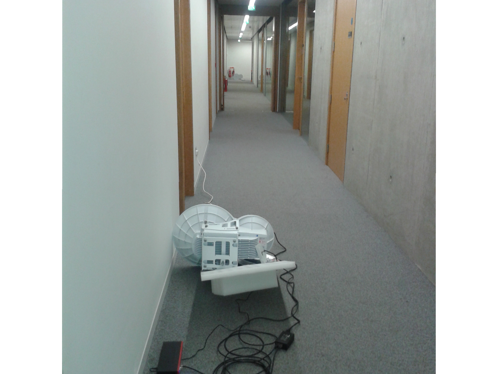

24GHz experiments
=================
This Website is intended to provide an ongoing account of a Scottish
Government funded experiment with wireless equipment that has the
potential to provide remote communities with ultra-fast broadband.

Introduction
------------
Many community broadband projects require a long-range wireless link
for their connection to the Internet.  The equipment of choice is
currently based on wifi operating in the unlicensed the 2.4
or 5GHz spectra.  This is
cheap: the equipment for a long-distance point-to-point link costs
under &pound400 and can provide bi-directional throughput of about 50Mb/s.
While this provides an improvement for the many rural communities that
are served by long copper telephone lines, 50Mb/s is no longer
adequate for a community of, say, 50 residences.   Technically, there
is no problem in getting more bandwidth in one of the licenced
spectra, but the equipment is more expensive and the additional cost
of the licence makes this option unaffordable for small communities.

Recently some new equipment operating at 24GHz has come on the
market from Ubiquiti. See [http://www.ubnt.com/airfiber].  This is advertised as
offering 1.4Gb/s at up to 13km.  Although not as cheap (a
point-to-point link costs about @pound3,000) it might present an
opportunity for some rural communities to upgrade their service to be
competitive with the current fibre based offerings in the UK, assuming
they can find an internet connection with that bandwidth.

With this in mind, the Scottish Government's Demonstrating Digital
programme provided the University of Edinburgh with funds to test this
equipment "in the wild".  Of course, there is ample evidence that the
equipment works, but most of the evidence we have is from
installations in urban areas over short distances.  How will it
perform over longer distances in West Highland weather?  And what are
the practical problems faced by communities who want to install it?

Background
----------

Before going into an account of the the project, let us look at some
of the pros and cons of using this equipment and what is already known
about wireless transmission in the 24 GHz spectrum.   We have already
noted that the equipment is affordable.  The advertised throughput of
1.4Gb/s presumably means  700Mb/s in each direction, but that would
provide a satisfactory connection for a hundred or so
residences. Moreover, transmission in this frequency is much less
likely to be affected by tidal reflection (a significant problem in
the Highlands and Islands)

There are some significant drawbacks, though.

* In the UK, although the 24GHz spectrum is unlicenced the power
  limits are such that it is unlikely that this equipment would be
  effective over the distances we have in mind.  We obtained a
  "non-operational" licence from Ofcom in order to test the equipment
  at the advertised power.

* Several of the links used by Tegola and related projects are longer
  than 13km

* Transmission in higher frequencies is adversely affected by high
  humidity and high temperatures.  Scotland benefits from only one of
  these.

* The Ubiquiti equipment uses substantially more power than their 5GHz
  offerings -- about 40W.  This would make it unsuitable for solar and
  wind-powered relays.

Our initial plan was to test the equipment on existing Tegola relays
one is a 6.5km link; the second 15.5km.  Although the latter is over
the advertised range, even a substantial fraction of the advertised
throughput would be useful.

The following is a roughly chronological account of the project.  The
initial installation was done during a period of very high winds in 
early January 2014.

December 2013: Initial configuration and testing
------------------------------------------------

We ordered and received one pair of radios.  Before deploying them we
thought it would be a good idea to check that they were working and
test them in ideal situation -- our office corridor.  One thing we
immediately noticed was how critical alignment is.  Even over a
distance of 35m, the performance fell of dramatically if the antennae
were slightly out of alignment. It's a very good idea to configure
equipment before deploying it, but to do this we had to turn off
sychronisation which relies on GPS and doesn't work indoors.

  

December 2013 & January 2014: strengthening the relays
------------------------------------------------------

Our basic relay construction (see the [relevant howto]) uses aluminium
pegs to anchor the diagonal braces to the ground.  Both sites were on
terrain that consisted of bedrock covered by peat of varying
depth. 
Although we have never had a problem with the pegs shifting,
peat is a bit jelly-like, and the structures can wobble through a cm
or two.  The alignment of 24GHz is much more critical than for the
lower bandwidths of 2.4 and 5.8GHz, so we replaced the pegs with epoxy bolts into the bedrock.  

 
<table>
<tr><td>
      
    Pegged anchors</td>
<td>
      
    Epoxy Anchors
</td>
</tr>
</table>

We also strengthened both relays.  For example, at one of our relays
we added an extra horizontal bar.

 
<table>
<tr><td>

      
    Corran Relay Before

</td><td>

      
    Corran Relay After

</td>
</tr>
</table>

January 2014. Installation and Alignment
----------------------------------------
The radios are reasonably light (under 10kg) but awkward to carry up hills.  We used an old backpack frame that
30 years ago had been used for carrying batteries up to community TV
relays. The radios come with a mounting frame that is first attached to the
structure. The radio is then "slotted" into the mounting frame.
This arrangement makes it quite easy to install the whole assembly
when working from a ladder.

      
    Local Transportation

The antenna can be aligned through elevation and azimuth adjustment
screws.  Unfortunately there is a great deal of backlash in these
screws, and they are almost useless if you are working in high winds. 
If the clamping bolts are loose, the antenna is blown around through
the considerable travel allowed by the adjustment screws. The signal
strength read-out is at the bottom of the antenna, and if the
alignment is being done from a ladder, you almost certainly need
someone below (with a hard hat) to squint up and call out the
figures.  

The installation instructions recommend an alternating process in
which one end of the link is adjusted then the other, and so on.
Unfortunately we were unable to complete this process before the
weather closed in and our workforce departed.  However, the alignment is good
enough that we can start taking some measurements. The initial
indications are that the link will work reasonably well over a
distance of 6.5km.

Performance
-----------

[http://www.ubnt.com/airfiber]:[http://www.ubnt.com/airfiber]
[relevant howto]:/howto/relay-construction.html
