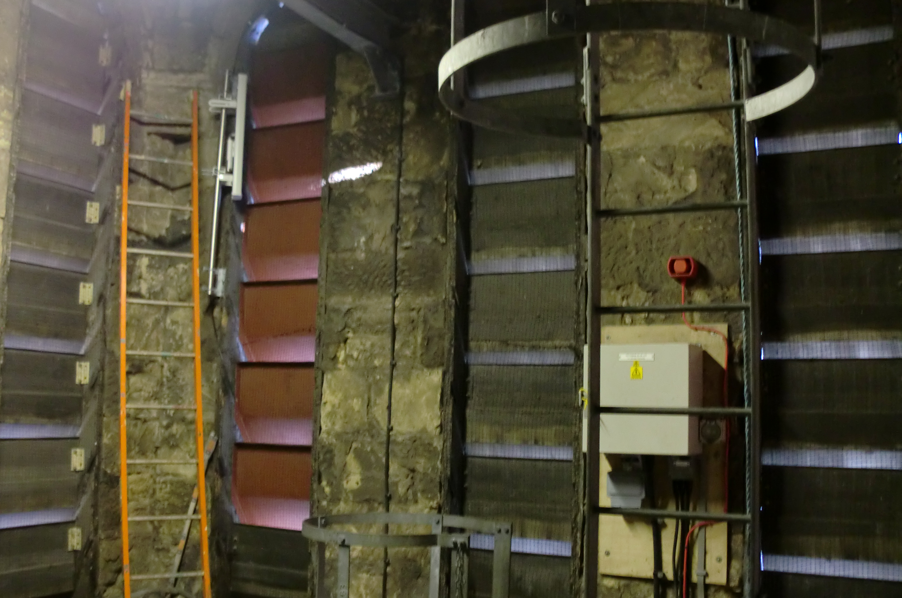
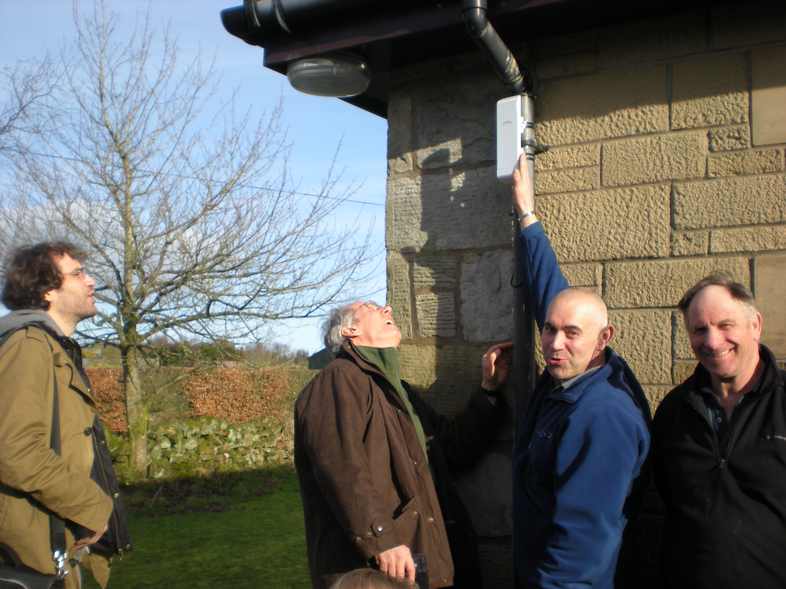

Allanton Community Broadband
============================
This is possibly the smallest project that HUBS has advised.  We
suspect that there may be many communities of this size that are
"below the radar" of community broadband projects and not large enough
to raise funding for external consultants or engineers. 

Allanton has small farming community consists of about 10 residences to the South of
[Shotts] and until a few days ago they had little or no broadband.  The telephone exchange is 6.7km by road.  There are currently
no plans to upgrade the exchange  to "superfast fibre", and even if fibre is brought to the
cabinets, it is unlikely that there will be a cabinet nearer than the
nearest town of [Allanton], about 4km from some of the community, and
that length of copper will not deliver fast broadband. Nor are [any
other neighbouring exchanges] in roll-out plans.

HUBS' engagement with the Allanton community started in May 2012 when
[Alex Neil] MSP for [Airdrie and Shotts] and then Cabinet Secretary
ford Infrastructure, asked us to help.  One of the embarassing
problems is that the government now requires farmers to file some of
their paperwork on-line. A previous meeting between BT and the
community had not been constructive.

Before meeting the community we did a little research. Ideally one would like to lay fibre through the community, but the
cost at this stage would be prohibitive so, using viewsheds as described in our [network
planning] section, we looked at the
possibility of wireless.  The community lies on a west-facing gentle
slope. Unfortunately there are no obvious hills that would support a
local distribution antenna, and trees are a serious problem.  

<table>
<tr>
<td>
 <a href="allanton-area.png">
 <image src="allanton-area-small.png" alt="Allanton area" width="500" />
 </a>
</td>
<td>
 <a href="anne-viewshed.png">
 <image src="anne-viewshed-small.png" alt="Comunity Viewshed" width="500"/>
 </a>
</td>
<td>
 <a href="coltness-viewshed.png">
 <image src="coltness-viewshed-small.png" alt="Coltness Viewshed" width="500"/>
 </a>
</td>
</tr>
<tr>
<td> General area of the community</td>
<td> Viewshed from the community</td>
<td> Viewshed from Coltness Memorial Church</td>
</tr>
</table>

Click on any image to enlarge

A viewshed from the middle of the community shows no line of sight to Allanton or Shotts (though these places
could be reached through an intermediate relay) but shows a possible
line of sight to [Cambusnethan], [Wishaw] and [Hamilton]. Although the
last of these is 14km away, we are operating over much longer
distances in the Highlands.

In June 2012 Peter visited Allanton and met with Alex Neil and several
members of this 
"disconnected" community.  Our experience is that any community
broadband project requires someone to set up and run the organisation
(communicate with the community, keep the books, keep track of
equipment etc.) and someone who will undertake the physical work of
installing the equipment.  Anne Graham agreed to provide the "brains"
and Hew Colquohoun the "brawn".  The main discussion was where to get
our connection to the Internet -- or "backhaul" as it is often
called.  Three possibilities were discussed:

* [Shotts].  This would require an intermediate relay, and although the
  community was well-engaged with people in Shotts, it wasn't clear
  what kind of Internet connection could be provided there.

* [Wishaw] or [Cambusnethan].  There is clear line of sight to these, but
  the only tall buildings are churches,  and again, no-one knew what
  kind of Internet service could be provided

* [Hamilton]. This is a large town and we had identified (from its 60's
  brutalist architecture as seen by walking down the streets on [Google Earth]) a tall building that very likely belonged to a
  university, which it did -- the [University of the West of Scotland] (UWS).  We
  were pretty sure they would have a good (probably fibre) connection
  and we thought that, following what [Tegola] and other [HUBS] projects have
  done, we could come to some agreement and obtain backhaul from them.

We agreed to pursue the second two options.  Initially we pinned most
of our hopes on UWS, but Anne also knew one of the churches in
Cambusnethan.  

In August, Marwan and Will visited UWS to see how well a trial link
would work.  While the staff there were accommodating, there were
clearly problems.  First, there is a plan to improve the appearance of the
building by shortening it.  Second, there were problems with the
building as it is (asbestos?) that made access to the roof impossible, so the
only possibility was to mount one end of the link inside a window.
Although they managed to get a signal to the Allanton community, it
was very weak.  

Fortunately, Anne and Hew had also followed up the possibility of a
church in Cambusnethan and had identified the [Coltness Memorial
Church] in Cambusnethan, whose steeple is clearly visible from most of
the area. Better still, the church was in an area served by Virgin
Media and there is good reason to believe that they have fibre along
the mail road just outside the church. Even with their (business)
consumer-grade Internet service, speeds of up to 100Mb/s ought to be
available!

 
 
    Inside the church tower

In September, or thereabouts, Will and Peter met up with Anne and Hew
to look at the church. The minister, the Reverend Graham Raeburn, was
extremely helpful, and when we went up the tower, things got even
better. The upper part of the tower had been modified by a mobile
phone company that had subsequently abandoned it.  The floors were
reinforced, the ladders were new and safe, and the louvres had been
replaced by fibreglass copies in order to be transparent to radio
transmission.

Tests between two [nanostations] about 5km apart, one on the church
tower and one in the community showed a perfectly good signal, though
there was rather more electronic noise than we were used to.  We
decided then that the best plan would be to do the distribution to the
consumers directly from the church rather than from some relay in the
middle of the community, simply because most of the community had
line-of-sight directly to the church.

Then things went a little slowly.  The church administration,
understandably, wanted to be sure that we were not going to do
anything that might prejudice their tower being used by another mobile
carrier and that we were not going to do anything that would be
visible. Once the agreement was drawn up it had to be passed on to
higher levels of adminstation for approval.  We had still hoped to be
up and running just after Christmas, but then Virgin couldn't find the
contract and a new one had to be drawn up.

In the meantime, Hew had done fantastic preparatory work in pulling ethernet cable
through the Church and preparing a mounting pole for the [sectoral
antenna] directly behind one of the plastic louvres.  He had also
worked out how to crimp RJ45 lugs and had mounted nanostations at two
houses.  

When Peter and Will visited in early February 2013 to get everything running, there was not a
great deal to do: mount the sectoral antenna, a small amount of
configuration,  and show Hew and Anne how
to configure the nanostations.  

 
     
    Peter inspects Hew's mounting for conformance   to West Highland
    Engineering standards

There are a few problems, first -- as we mentioned above -- there is a
lot of electronic noise, possibly from the power lines and wind farms
that surround the area. We found that a [directional antenna], which
costs no more than the kind of Nanostations they are using, gives better
performance.  Also, the speeds from Virgin are still rather slow and
there is still some tweaking needed to get the available badwidth to
the community.  But they now have something that is at least
acceptable and it is only going to get better.

The future.  We believe that the current system will work well for
at least five years, but what should the community aim for?  First,
the land is criss-crossed by a number of dismantled railway lines and
tramways that were built to serve the mines that once operated there.
Also, the land is in owned by the community, so laying fibre to connect the ten
or so houses should be relatively easy and cheap.  The fibre could be
connected to an upgraded wireless link to the Church.

The longer-term success of this network and others like it depends on
the accessibility of high-bandwidht network infrastructure. The
community will only get so far by purchasing consumer-grade Internet
service and sharing it amongst themselves. Let us hope that Scottish
Government provides open access to a fibre backbone that could serve
communities such as this -- one could easily imagine the Coltness
Memorial Church, with its great lines of sight, being one such open
network access point.

[Alex Neil]: http://en.wikipedia.org/wiki/Alex_Neil_(politician)
[Airdrie and Shotts]: http://en.wikipedia.org/wiki/Airdrie_and_Shotts_(Scottish_Parliament_constituency)
[Shotts]: http://en.wikipedia.org/wiki/Shotts
[Allanton]: http://en.wikipedia.org/wiki/Allanton,_North_Lanarkshire
[Cambusnethan]: http://en.wikipedia.org/wiki/Cambusnethan
[Wishaw]: http://en.wikipedia.org/wiki/Wishaw
[Hamilton]: http://en.wikipedia.org/wiki/Hamilton,_South_Lanarkshire
[University of the West of Scotland]: http://www.uws.ac.uk/home/
[Tegola]:  /tegola-history.html
[HUBS]: /index.html
[Coltness Memorial Church]: http://www.coltness-memorial.org.uk/Coltness_Memorial_Church/Home.html
[nanostations]: http://www.ubnt.com/airmax#nanostationm
[sectoral antenna]: http://dl.ubnt.com/AirMax5GSectors.pdf
[directional antenna]: http://dl.ubnt.com/datasheets/nanobridgem/nbm_ds_web.pdf
[Google Earth]: http://www.google.co.uk/intl/en_uk/earth/index.html
[any other neighbouring exchanges]: rolloutplans.html
