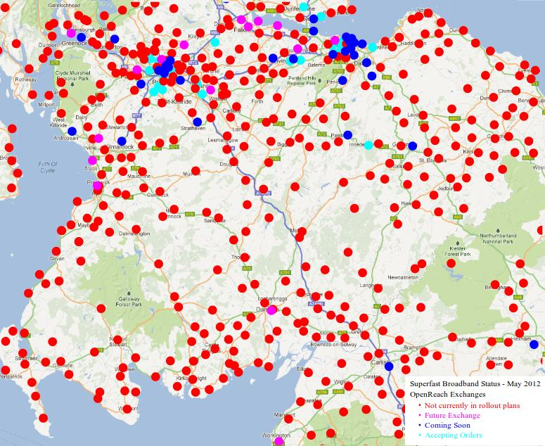

 
This picture shows BT's plans for the exchanges surrounding the Allanton
Community. AO = "Accepting orders"; CS = "Coming soon"; FE = "Future
exchanges"; and NC = "Not currently in rollout plans"

 
The picture for the whole of the South of Scotland is quite
depressing.  This picture shows the exchange status in May 2012.  The
circles have a radius of approximately 2km, so even if they were all
upgraded it is uncertain whether people outside these circles would
get superfast broadband.  Any community not in or very near a red
cirle is likely to be in the same boat as Allanton!

