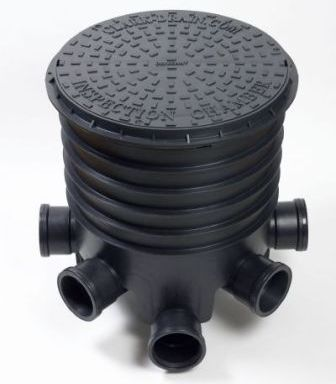

As many of you already know we are hoping to pull optic fibre through
Arnisdale and later to as much of the Loch Hourn Broadband
Cooperative's network as possible.  The first, and most critical part
of this operation is  to lay fibre ducting through Arnisdale, or more
precisely, Camàs Ban.  We want to do it with minimum disruption and
maximum benefit to all concerned.  
 
The general plan is to bury flexible pipe along the backs of the
houses with an occasional junction box from which armoured fibre will run
to the individual houses. Here's how you can help:

* Help to plan the details of the ducting.

* Indicate that you will sign the [wayleave consent form](LHBBC-Wayleave.pdf), if relevant.

* Help with laying the ducting and fibre

[Here is a *tentative* plan.](fiberplan+utilities.pdf)  It requires your help to
refine it.  The ducting itself is probably going to be 50mm or 90mm
plastic pipe (Marine Harvest may have some surplus that we can
use). The junction boxes will probably be the standard sewer line
inspection chambers with a circular lid that will withstand about 3.5
tons.  Please consult with your immediate neighbours about where best
to locate the pipe and junction boxes. Here are maps of the
[east](arnisdale2.pdf) and [west](arnisdale1.pdf) ends of the village if you need them.

      
    Junction Box

Obviously the pipe should be laid where there is least disruption to
gardens etc.  In general, the best position appears to be a few metres back
from the existing water main.  The pipe should, if possible,
run in a straight line between the junction boxes.  The armoured fibre
that will run from the individual houses is very thin: it can be dug
in or run along fences to suit.  Please consider this in suggesting the
position of junction boxes.

Although we will hire a contractor with a small digger to lay the main ducting, we
will, as always, be looking for volunteers to help defray the costs.

The [wayleave consent form](LHBBC-Wayleave.pdf) is a modification of one that was created by
another rural broadband network [B4RN]. It is refreshingly simple and clear.

Peter Buneman 
14 April 2013
[B4RN]:http://b4rn.org.uk/
