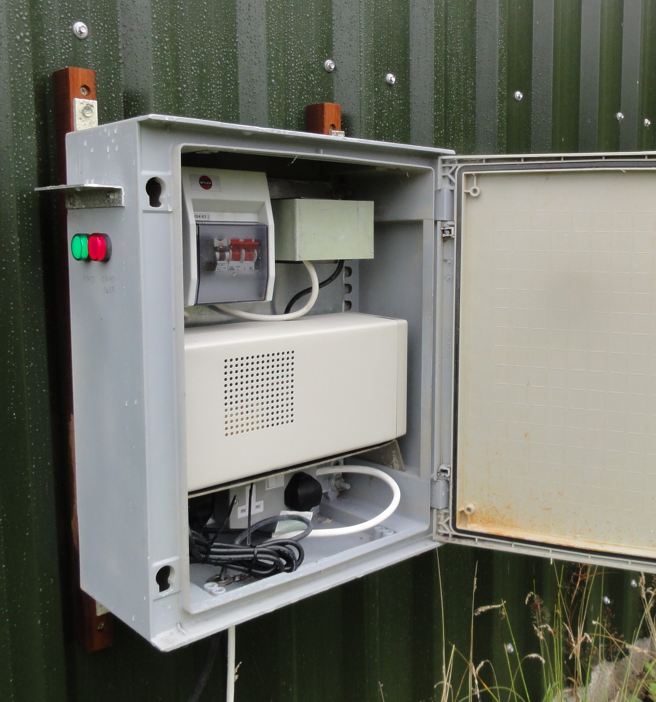
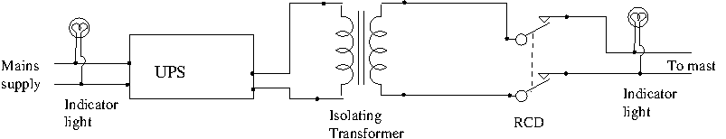

Providing mains power to masts
==============================

Connecting a mast to the mains is straightforward, but some care is
needed if the mast is some distance -- maybe 1000m -- from the power
source.  First, you will be using armoured cable which, at the time of
writing, can be bought for under £1 per metre. Armoured cable requires
special underground junctions -- be sure to use the epoxy kind -- and
terminals (called glands), but these are all straightforward to use.
Cable should also be buried. The method and depth depends on the land
and the wishes of the landowner. I have had quote of £1 per metre for
burying cable over quite rugged ground, so even when properly dug in,
cable may be a cheaper alternative to solar and wind power for all but
the most remote masts.

Cable weighs 300-400kg per 1000m and comes in big drums.  If you have
some sort of buggy like an Argocat that can reach the mast, you may be
able to rig up an axle to support the drum and unroll it as you drive
up the hill.  Alternatively you can cut it into sections of 200-300m
and have some kind of Egyptians and Israelites event when you drag it
up the hillside.  In fact the cable is quite slithery and dragging it
over grass and heather is surprisingly easy.

Wireless equipment consumes relatively little power. For example, the
[manufacturers blurb on the Ubiquiti Rocket][rocket] says 6.5W which agrees
well with what I have measured (I measured the power at the mains --
including the adapter -- and under heavy traffic, which can increase
the power draw).  So a typical mast installation consisting of two
long distance links and one or two wireless cards for local
distribution is probably going to be around 30W (remember to add in
the power required by an ethernet switch).

[rocket]: http://www.ubnt.com/downloads/datasheets/rocketm/rm_ds_web.pdf

To keep the cost  to a minimum, you will want to use the smallest
diameter copper core, 1.5mm\\(^2\\).  The resistance of this is given as
about 12 ohms per 1000m.  Given that we know the power required by the
equipment and the cable length we can calculate the the
voltage drop on the line:

<table class="table table-striped">
<tr>
<th>\(L\backslash W_E\)</th>
<th>   20</th>
<th>   40</th>
<th>   60</th>
<th>   80</th>
<th>  100</th>
<th>  120</th>
<th>  140</th>
<th>  160</th>
<th>  180</th>
<th>  200</th>
</tr>
<tr>
<th>  200</th>
<td>239.6</td>
<td>239.2</td>
<td>238.8</td>
<td>238.4</td>
<td>238.0</td>
<td>237.6</td>
<td>237.2</td>
<td>236.8</td>
<td>236.3</td>
<td>235.9</td>
</tr>
<tr>
<th>  400</th>
<td>239.2</td>
<td>238.4</td>
<td>237.6</td>
<td>236.8</td>
<td>235.9</td>
<td>235.1</td>
<td>234.3</td>
<td>233.4</td>
<td>232.6</td>
<td>231.7</td>
</tr>
<tr>
<th>  600</th>
<td>238.8</td>
<td>237.6</td>
<td>236.3</td>
<td>235.1</td>
<td>233.8</td>
<td>232.6</td>
<td>231.3</td>
<td>230.0</td>
<td>228.7</td>
<td>227.3</td>
</tr>
<tr>
<th>  800</th>
<td>238.4</td>
<td>236.8</td>
<td>235.1</td>
<td>233.4</td>
<td>231.7</td>
<td>230.0</td>
<td>228.2</td>
<td>226.4</td>
<td>224.6</td>
<td>222.8</td>
</tr>
<tr>
<th> 1000</th>
<td>238.0</td>
<td>235.9</td>
<td>233.8</td>
<td>231.7</td>
<td>229.5</td>
<td>227.3</td>
<td>225.1</td>
<td>222.8</td>
<td>220.4</td>
<td>218.0</td>
</tr>
<tr>
<th> 1200</th>
<td>237.6</td>
<td>235.1</td>
<td>232.6</td>
<td>230.0</td>
<td>227.3</td>
<td>224.6</td>
<td>221.8</td>
<td>219.0</td>
<td>216.0</td>
<td>213.0</td>
</tr>
<tr>
<th> 1400</th>
<td>237.2</td>
<td>234.3</td>
<td>231.3</td>
<td>228.2</td>
<td>225.1</td>
<td>221.8</td>
<td>218.5</td>
<td>215.0</td>
<td>211.4</td>
<td>207.6</td>
</tr>
<tr>
<th> 1600</th>
<td>236.8</td>
<td>233.4</td>
<td>230.0</td>
<td>226.4</td>
<td>222.8</td>
<td>219.0</td>
<td>215.0</td>
<td>210.9</td>
<td>206.5</td>
<td>202.0</td>
</tr>
<tr>
<th> 1800</th>
<td>236.3</td>
<td>232.6</td>
<td>228.7</td>
<td>224.6</td>
<td>220.4</td>
<td>216.0</td>
<td>211.4</td>
<td>206.5</td>
<td>201.4</td>
<td>195.9</td>
</tr>
<tr>
<th> 2000</th>
<td>235.9</td>
<td>231.7</td>
<td>227.3</td>
<td>222.8</td>
<td>218.0</td>
<td>213.0</td>
<td>207.6</td>
<td>202.0</td>
<td>195.9</td>
<td>189.3</td>
</tr>
</table>

Let

* \\(V_E\\) = voltage across equipment,
* \\(V_D\\) = voltage drop on cable,
* \\(V_S\\) = voltage at source (\\(V_S = V_D + V_E\\)),
* \\(R_C\\) = resistance of cable, and
* \\(W_E\\) = power required by equipment.

If \\(I\\) is the current through the cable, we have \\(V_EI = W_E\\),
\\(V_D/R_C = I\\) so \\(V_EV_D = W_ER_C\\) so that
\\(V_E^2 - V_SV_E + W_ER_C = 0\\).
From high-school math,
\\(V_E = 1/2(V_S \pm \sqrt{V_S^2 -4W_ER_C})\\) or
\\(V_E = 1/2(V_S \pm \sqrt{V_S^2 -8W_ERL})\\) where \\(L\\)
is the length of the cable and \\(R\\) the resistance per unit length
of the conductor -- remember there are two conductors!

The table at the right assumes a source voltage of 240V and shows the
voltage at the mast for varying cable lengths 
\\(L\\) and power consumptions \\(W_E\\).

Most power adapters work over a wide range of voltages, so you can
power a substantial amount of wireless kit without difficulty.  But
once you have mains power at a mast it is tempting to use it for other
things like power tools.  Be careful!  It won't damage a long cable, which
will just get slightly warm, but it may not be good for your tools.

Safety considerations
---------------------

Once you have installed the cable, use a meter to check that there is
no leakage to earth from either conductor.  Also check the total
resistance of the conductors (connect the two at one end and measure
the resistance at the other -- being sure that the whole thing is
unplugged when you do this!)  If you are using 1.5mm\\(^2\\) cable,
you should see something that is about \\(12\Omega\\) per kilometre.
For example a 1.5km cable should give about \\(36\Omega\\) (remember
you are measuring the sum of the resistances of the two conductors).

    
  Power supply box showing RCD (top left), isolating
  transformer (top right, behind cover) and UPS (bottom)

Whatever the rules about digging in cable, I believe that by far the
best safety measure is a [residual current device]  or RCD. They are
standard for garden equipment and required in some countries for
outdoor wiring and wiring in kitchens and bathrooms.  What these
gizmos do is to detect the difference in the current flowing up the
cable and that flowing back.  If there is a difference it is probably
the result of a leak to earth caused by a cable fault or an
inquisitive hiker putting his fingers in your kit. If this happens,
the power is disconnected immediately.  Try to get a *latching* RCD.
These come back on after a power cut.

[residual current device]: http://en.wikipedia.org/wiki/Residual-current_device

Now we have experienced problems with RCDs on long cables: they trip
for no obvious reason.  I suspect, though I have not done the sums,
that this can be caused by spikes on the power supply.  The theory is
that capacitance of the cable is such that a spike *on the power
supply* on one conductor will be absorbed in the cable causing a
temporary difference.  I need to check this with a power engineer, but
we have found that adding an isolating transformer solves the problem.
Try to get one that provides the power you want ([1]) ,
the big ones that are designed for heavy-duty equipment outdoors waste
a lot of electricity. This picture shows the wiring.  The indicator
light is a good idea: it provides an easy check that the power supply
is working.

[1]: http://uk.rs-online.com/web/p/products/0504167

Backup
------

Rural electricity supplies are unreliable, so you may also want to put
a backup power supply (UPS) at the source.  About £200 buys you ([2]) a
supply which is quoted as providing 38 minutes at 200W.  For 30W you
would presumably get about about 6 times that -- over 4 hours.

[2]: http://www.apc.com/products/family/index.cfm?id=27

If you, want to provide backup that lasts for days rather than hours,
you can buy a humongous UPS, but these are very expensive, and an
alternative is to build one yourself with equipment designed for
caravans.  Caravaners have less money than IT departments, so the
savings can be substantial. Roughly, you get a large car/truck
battery.  A 12V 125AH battery should last 2 days with a 30W draw, and
you can connect two or more in parallel if you want a longer period.
You also need an inverter and a relatively beefy charger that is
designed to be used continuously.  I haven't done this yet, so I don't
want to give more details.  Such a system would obviate the need for
an isolating transformer, but it may waste electricity to have the
inverter running all the time. In which case you would add a relay to
switch to battery only when the mains supply fails (this is what a UPS
does); and you will then need an isolating transformer.

   
    
  Wiring diargram for power supply at base

----
[Original version] of this article.

[Original version]: cabling.pdf
