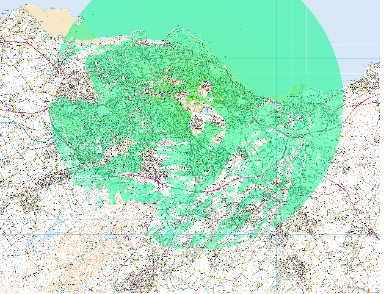

Documenting some first steps with [GRASS] to do some geographical
analysis for planning of radio installations. This was after some
frustration at the clunkiness of on-line services like [Hey What's
That]. The only feasible alternative seemed to be to start using a
proper GIS system ourselves and then try to make available the 
specific operations that we use so we don't have to do all the
analysis ourselves.

[GRASS]: http://grass.osgeo.org/
[Hey What's That]: http://www.heywhatsthat.com/

So the first step was to obtain some data to use as a background map
so we can eyeball what we're doing and some topological data. As
academics we have access to both of these from the [Ordnance Survey]
through [EDINA]. What we get from EDINA is the Master Map in
either 1:10k or 1:25k resolution and the PROFILE DTM topological data 
at 1:10k resolution.

[Ordnance Survey]: http://www.ordnancesurvey.co.uk/
[EDINA]: http://edina.ac.uk/

This data comes to us as a lot of small files. In the case of the
background map it is tiny TIFF files together with some information
about how each file maps onto the real-world coordinate system, in a
separate file with a .tfw extension. To be able to display these in a
GIS system, they have to be merged into one big tiff, which ought as
well to use the extensions that allow it to carry some information
about the coordinate system. We use the *gdal_merge.py* program for
this. 

    gdal_merge.py -pct -o edinburgh_raster_10k.gtiff -of Gtiff raster-10k/*.tif

The *-pct* option means to grab the colour map from the first tiff
file otherwise what you'll eventually see is an unreadable dark
greyscale image.

The next step is to import the data into GRASS's internal format. The
first thing to understand is that in this case though the GeoTIFF file
now carries coordinate information, it doesn't carry the information
about which coordinate *system* or projection is being used. Because
this data comes from the Ordnance Survey, we know it is British
National Grid using the OSGB1936 datum a.k.a. EPSG:27700. This becomes
important when combining with maps from other sources and making
measurements such as distance.

In any event, we import the GeoTIFF file and create a new "location"
called, in this case, Edinburgh. The "-o" flag causes GRASS to ignore
the lack of projection information carried in the source file. The
name of the command, *r.in.gdal*, means that it is about raster maps
(*r*) and input (*in*) and uses the [GDAL] library that knows about
working with these sorts of files.

    r.in.gdal -o in=edinburgh_raster_10k.gtiff out=raster_10k location=Edinburgh

[GDAL]: http://trac.osgeo.org/gdal

Now for the topological data. The default way to download it gives you
an NTF file. This is a format that the Ordnance Survey uses and is a
vector format, even though for the Digital Terrain Map it is basically
point data. If you try using this GRASS will try to add all the
millions of points to a spatial index. This will be very slow and
probably use up all of the available RAM. It is better to download it
as TIFF files. These can then be imported in the same way as described
above. 

    gdal_merge -o edinburgh_profile_dtm.gtiff profile-dtm/*.tif
    r.in.gdal -o in=edinburgh_profile_dtm.gtiff out=profile_dtm

It probably makes sense to do this first, before the background
map. The reason being that the TIFF files one gets for the DTM data do
contain projection information and coordinate system embedded, that
is, they are GeoTIFF files. If the "location" is created from them,
it will have the correct projection automatically.

----

Reading the Wiki page about [Contour Lines to Digital Elevation
Model]s, I wonder if it would not have been better to obtain the
countour lines rather than the pre-computed DTM from EDINA. Perhaps
not as we would have to compute the DTM ourselves in any case. Where
might contour lines be more useful on their own?

[Contour Lines to Digital Elevation Model]: http://grasswiki.osgeo.org/wiki/Contour_lines_to_DEM

----

Now, let's compute a viewshed from the top of Arthur's seat which, in
British National Grid coordinates, is at (327529.027, 672952.178). We
do this with the *r.los* command.

    r.los input=profile-dtm output=arthur_seat \
        coordinate=327529.027,672952.178 obs_elev=2 max_dist=1000

This computes the viewshed from 2m above the surface out to a
maximum of 1km.

This may or may not work and may or may not have errors. It is also
slow. The [r.viewshed Add-on] does better. It means you need to have
GRASS compiled with C++ (*--enable-cxx*) and probably largefile
(*--enable-largefile*) support.

There also seems to be a minor installation bug that stops extensions
from being properly installed. It can be fixed by doing,

    mv /usr/local/grass-6.4.3RC2/tools/g.html2man tmp.$$
    mv tmp.$$/g.html2man /usr/local/grass-6.4.3RC2/tools/g.html2man
    rmdir tmp.$$

So then you can install the extension from within GRASS by doing

    g.extension extension=r.viewshed

and it will download and install it. The *r.viewshed* command takes
almost exactly the same arguments as *r.los*, plus a few more because
it's can do more sophisticated analysis. To start, having perhaps run
*r.los* already to see how slow it is,

    r.viewshed input=profile-dtm output=arthur_seat \
        coordinate=327529.027,672952.178 obs_elev=2 max_dist=10000 \
        --overwrite 

the last argument causing the result layer to be overwritten if it
already exists.

[r.viewshed Add-on]: http://grasswiki.osgeo.org/wiki/GRASS_AddOns#r.viewshed

The result is something that can be displayed like this:

  

