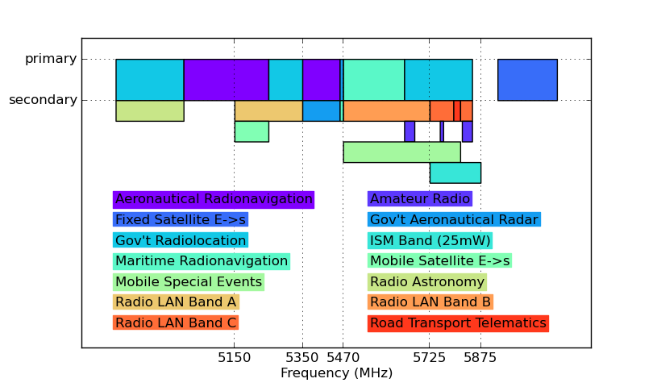

The 5GHz radio spectrum and licensing
=================================

Radio transmissions are, in general, regulated by national
organisations, [Ofcom] in the UK, the [CRTC] in Canada, the [FCC] in
the United States, and so forth. The rules vary to an extent and are
coordinated in Europe with [CEPT] and internationally with the [ITU].
In Europe, for the most part, CEPT recommendations on the use of
different frequencies are transformed into directives by the European
Commission and then implemented in national law by the member states.
In general, and where it can be helped, CEPT won't produce
recommendations that are at odds with ITU policies and close attention
is paid to existing usage when new rules are being developed, as they
were in the late 1990s and early 2000s for the 5GHz band, which is of
particular interest for community wireless networks.

The whole process is quite complicated, and if you look at the Ofcom
rules, they are pretty simple and easy to read, but they defer to the
European rules and a host of standards from the [ETSI] and elsewhere,
and pretty soon it is easy to get lost in thousands of pages of
documents. This is an attempt to explain the relevant parts of the
rules in a simple way and lay out what you need to know to build
wireless networks out of readily available commodity hardware, with
pointers to the official documents where the actual rules are laid out
in excruciating detail.

 
  

**The basic rule is, respect your neighbours which means, in particular,
do not cause interference.** This principle underlies most of the EC
Directive [1999/5/EC] which is concerned with making sure equipment
certified for use in the EU does not cause harmful interference. To
accomplish this, Ofcom uses the powers from the [Wireless Telegraphy
Act 1949] to sell licenses for the use of various bands. Some bands,
like 5GHz, are shared between different services. Where a band is
shared it typically has a primary and some secondary services. The
secondary services must not interfere with the primary ones.

The image at right shows what the 5GHz spectrum looks like. It's
actually pretty busy with all kinds of radar services and such. The
802.11a or 802.11n parts of the band are described as "Radio
LAN". Radar transmits in short bursts and wanders all over the
band. Because of this, it is feasible to use the band when there is no
nearby radar actively transmitting. To facilitate this, there are some
extra requirements that have to be met in order for the general public
to use the band.

The first requirement is another of the general rules of radio
operations. It's pretty simple: **only use the minimum power needed to
establish and maintain communications**. The particular arrangement
for these bands is formalised and elaborated in the ETSI [EN 302 502]
standard where a Transmit Power Control (**TPC**) mechanism is
described. In short, the equipment must automatically lower its
transmit power to the minimum that is needed. If an 802.11a radio does
not support this feature it should not be used in the UK (unless it is
already very low power). If your radio has an option to enable or
disable TPC, it must be enabled.

The next requirement is also a codification of another rule of radio
ops: **listen before you transmit**. It arrangement is called Dynamic
Frequency Selection (**DFS**). This means the radios listen for other
transmissions and if necessary switch to a different channel to avoid
causing interference. As with TPC, DFS must be supported by the
equipment and must be enabled.

The Radio LAN sub-band is further divided into three parts, A, B and
C. Different conditions apply to each of these. The A band is for
indoor use only to avoid interference with the mobile satellite uplink
service. It is also limited to a low power, 200mW, but does not
require a license. The A band should not be used for outdoor backbone
links.

The B band is more useful for community networks. There is a higher
power limit of 1W. Some [early documents] suggest that it is only to be
used for mobile or nomadic, however the current rules covering its
use, [IR 2006] makes no mention of nomadic operations and only says it
may be used indoors or outdoors (IR 2006 also covers the A band).

The C band requires a license. This license permits installations at
specific places and is not very expensive or difficult to obtain. The
output power is still greater at up to 4W and there are also some
restrictions on how point-to-multipoint or sectorised distribution
antennas must be installed -- roughly they must be pointed downwards
at an angle of greater than 15 degrees with respect to the tangent
plane to the earth. The conditions on use of the C band are laid out
in [IR 2007]

There is also a little notch carved out of the C band that is not
available for use, between 5795 and 5815 MHz. This is reserved for
road transport telematics.

The power limits are treated in a specific way, in terms of
[equivalent isotropically radiated power] or (EIRP). This mouthful means
that the transmitter and the antenna are treated together as one unit
and the power is calculated as follows. The limit (say 4W for the C
band) is for a theoretical antenna that radiates uniformly in all
directions. If you replace that antenna by one, say, that has a gain
of 3dBi (double) in one direction, and radiates nothing in the opposite
direction, you are allowed to transmit half the power. This means you
can't put an 18dBi dish (64x) on a 4W transmitter in order to achieve
the equivalent of a 250W transmitter in the direction you are
interested in. That would be cheating.

Converting dBm / dBW to W
=========================

Manufacturers of radios and antenna almost always helpfully quote the
power output in terms of dBm (or dBW for larger radios). The
regulations are in terms of watts so what to do? It is annoying, but
the wikipedia page for
[EIRP](http://en.wikipedia.org/wiki/Equivalent_isotropically_radiated_power)
explains it fairly well. If you know the power output of the radio,
the cable loss (just say 0) and the gain of the antenna, when
expressed in dB you can just add them up, \\(P_E = P_T - L_c +
G_a\\).

So suppose you have a Ubiquiti [Rocket M5] and you've maxed the power
output to 27dBm and pluged into the theoretical ideal antenna. What is
its power output in terms of watts? So in this case, we have \\(27 =
10 log (P_w) \\) where \\(P_w\\) is the power output of the radio in
mW. Rearanging, \\(P_w = 10^{27/10} = 501 mW = 0.5 W\\).

Now lets say we keep the power maxed and and connected it to a 34dBi
dish. This adds up to a 61dBm signal or, doing the same arithmetic
1.25kW EIRP -- well in excess of the regulatory limit!

What are the regulatory limits in terms of dBw? Doing the calculation
in reverse for 200mW, 1W and 4W we get 23dBm for band A, 30dBm for
band B and 36dBm for band C. So whatever you do, make sure the
settings on your radio plus the gain of your antenna add up to less
than those numbers!

Apply for a 5.8GHz Ofcom License
================================

Application for a license to use band C is done by [filling in a form]
and submitting it to Ofcom. As this is for fixed sites only you will
have to provide the location of each radio (terminal), which includes
client installations. The fee is £1/terminal/year with a minimum fee
of £50.

Summary
=======

 * Do not transmit outside of bands where you are entitled to -- this
   means only using band B and using bands B and C if you have a
   license to do so.

 * Do be considerate to other band users by listening before
   transmitting and switching to another channel if necessary
   (**DFS**).

 * Do use the minimum possible transmit power and use **TPC** to have
   the equipment automatically adjust.

  
  <table>
    <tr><th></th><th>Band A</th><th>Band B</th><th>Band C</th></tr>
    <tr>
        <th class="rowh">Frequencies</th>
        <td>5150-5350 MHz</td>
        <td>5480-5725 MHz</td>
        <td>5725-5850 MHz</td>
    </tr>
    <tr>
        <th class="rowh">Power Output</th>
        <td>200mW / 23dBm EIRP</td>
        <td>1W / 30dBm EIRP</td>
        <td>4W / 36dBm EIRP</td>
    </tr>
    <tr>
        <th class="rowh">Restrictions</th>
        <td>Indoor Only</td>
        <td></td>
        <td>No use of 5795-5815 MHz</td>
    </tr>
    <tr>
        <th class="rowh">Licensing</th>
        <td>None</td>
        <td>None</td>
        <td>Required</td>
    </tr>
    <tr>
        <th class="rowh">Ofcom Rules</th>
        <td>IR 2006</td>
        <td>IR 2006</td>
        <td>IR 2007</td>
    </tr>
  </table>

[Ofcom]: http://www.ofcom.org.uk/
[CRTC]: http://crtc.gc.ca/
[FCC]: http://www.fcc.gov/
[CEPT]: http://www.cept.org/
[ETSI]: http://www.etsi.org/
[ITU]: http://www.itu.int/
[Wireless Telegraphy Act 1949]: http://www.legislation.gov.uk/ukpga/Geo6/12-13-14/54/contents
[1999/5/EC]: http://eur-lex.europa.eu/LexUriServ/LexUriServ.do?uri=OJ:L:1999:091:0010:0010:EN:PDF
[EN 302 502]: http://www.etsi.org/deliver/etsi_en/302500_302599/302502/01.01.01_60/en_302502v010101p.pdf
[early documents]: http://www.ofcom.org.uk/static/archive/ra/topics/mobiledata/5ghz-licensing.htm
[IR 2006]: http://stakeholders.ofcom.org.uk/binaries/spectrum/spectrum-policy-area/spectrum-management/research-guidelines-tech-info/interface-requirements/uk2006.pdf
[IR 2007]: http://stakeholders.ofcom.org.uk/binaries/spectrum/spectrum-policy-area/spectrum-management/research-guidelines-tech-info/interface-requirements/uk_interface_2007.pdf
[equivalent isotropically radiated power]: http://en.wikipedia.org/wiki/Equivalent_isotropically_radiated_power
[filling in a form]: http://licensing.ofcom.org.uk/radiocommunication-licences/fixed-wireless-access/
[Rocket M5]: http://www.ubnt.com/airmax#rocketm
